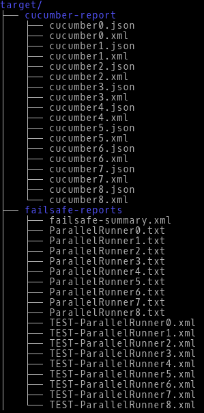

# cucumber-slices-maven-plugin
The Cucumber Slices Plugin is designed to parse Cucumber feature files with 1 or more scenarios into many feature files, each with 1 scenario per feature file.  Each of the parsed feature files is associated with a Cucumber runner that is automatically generated at runtime. 

The plugin can be used in combination with either the [Maven Surefire Plugin](http://maven.apache.org/surefire/maven-surefire-plugin/) or the [Maven Failsafe Plugin](http://maven.apache.org/surefire/maven-failsafe-plugin/) to run each of the generated feature files in parallel. Further information on how to configure these plugins to run Cucumber feature files in parallel is discussed in the [Running Scenarios In Parallel](#running-scenarios-in-parallel) section.

## Installation

Simply add the following to the `plugins` section of your POM file

```xml
        <plugins>
            <plugin>
                <groupId>com.disney.studio.cucumber.slices.plugin</groupId>
                <artifactId>cucumber-slices-maven-plugin</artifactId>
                <version>[include latest version here]</version>
                <executions>
                    <execution>
                        <phase>generate-test-resources</phase>
                        <goals>
                            <goal>generate</goal>
                        </goals>
                        <configuration>
                            <cucumberTags>
                                <param>@regression</param>
                            </cucumberTags>
                            <templatesDirectory>src/test/resources/templates</templatesDirectory>
                            <parallelRunnersDirectory>src/test/groovy/parallel_runners</parallelRunnersDirectory>
                        </configuration>
                    </execution>
                </executions>
            </plugin>
        </plugins>
```

## Configuration Settings

Cucumber Slices supports the following `<configuration>` settings

**parallelRunnersDirectory**: A directory that shall contain the Cucumber runner class files. The files contained within this directory are created at runtime. The directory **MUST** exist somewhere on the _test_ classpath because the files within the directory need to be compiled during the `test-compile` phase.
* _default value_: NONE
* _property_: parallelRunnersDirectory
* _required_: YES

**templatesDirectory**: A directory whose contents contain references to templates used within the plugin. This directory MUST contain the file labeled cuke_runner_template.txt. An example of the template file (Groovy-specific) is contained in the example_template directory within the root of this repository.
* _default value_: NONE
* _property_: templatesDirectory
* _required_: YES

**featuresDirectory**: A directory containing the Cucumber feature files. The directory MUST be in the root of the runtime classpath
* _default value_: src/test/resources/features
* _property_: featuresDirectory
* _required_: YES

**cucumberTags**: A list of tags used by the plugin to filter which scenarios shall be read
* _default value_: NONE
* _property_: cucumberTags
* _required_: NO

The property values listed in each of the configuration settings can be used in place of the POM file settings.  For instance, you may execute the following Maven command

```maven
mvn generate-test-resources -DparallelRunnersDirectory='src/test/groovy/parallel_runners' -DtemplatesDirectory='src/test/resources/templates'
```

## Setup

After installing the plugin within your POM file,

1. Download a copy of the `cuke_runner_template.txt` from this repositories **example_template** directory.
2. Place a copy of the downloaded file within the `templatesDirectory` you've defined in your POM file.  It should be noted, that the example `cuke_runner_template.txt` file is based on Groovy code.
3. Open the `cuke_runner_template.txt` file you copied to the templates directory in Step 2, and change the `glue` statement to point to where your Cucumber step files are located

DO NOT remove or change lines associated with the tags labeled `<feature file>` or `<runner index>`.  These will be used internally at runtime.

### Groovy Example of `cuke_runner_template.txt`

```groovy
import cucumber.api.CucumberOptions
import cucumber.api.junit.Cucumber
import org.junit.runner.RunWith

@RunWith(Cucumber.class)
@CucumberOptions (
        features = ["classpath:parallel_features/<feature file>"]
        , monochrome = true
        , format = ["pretty", "json:target/cucumber-report/TestGroup<runner index>/cucumber.json", "junit:target/cucumber-report/TestGroup<runner index>/cucumber.xml"]
        , glue = ["src/test/groovy/path/to/your/steps"]
        , tags = ["~@manual"]
)
class ParallelRunner<runner index> {
}
```

### Java Example of `cuke_runner_template.txt`

```java
import cucumber.api.CucumberOptions;
import cucumber.api.junit.Cucumber;
import org.junit.runner.RunWith;

@RunWith(Cucumber.class)
@CucumberOptions(
    features={"classpath:parallel_features/<feature file>"}
    , monochrome = true
    , format = {"pretty", "json:target/cucumber-report/TestGroup<runner index>/cucumber.json", "junit:target/cucumber-report/TestGroup<runner index>/cucumber.xml"}
    , glue = {"com.mycompany.cucumber.stepdefinitions"} // package name where the step definition classes are kept
    , tags = {"~@manual"}
    )
public class ParallelRunner<runner index> {
}
```

The following is a breakdown of the tags noted in the template

**&lt;feature file&gt;**: this tag represents the feature file name that shall be created at runtime.  Example: `the-search-for-cheese-072410-64.feature`. The resulting feature file name is a combination of the feature's name and the scenario's name, along with a timestamp.

**&lt;runner index&gt;**: this tag represents the value of a counter that is used to designate a unique Cucumber Runner class. Example: `ParallelRunner0`, `ParallelRunner1`, etc.  There should be 1 ParallelRunner class generated for each feature file created at runtime.

## Disassemble and Reassemble Process Details

The process of parsing and reassembling the feature files is outlined below:

1. At runtime, during Maven's **generate-test-resources** or **generate-test-sources** phase, the **generate** goal is executed
2. During execution,
    1. Read in all of the Cucumber feature files
    2. Parse the plain text files into JSON
    3. Extract from the JSON data structure the following elements
        1. **Feature** statement
        2. **Background** statement
        3. **Scenario** statement or **Scenario Outline** statement
        4. **Given**, **When**, and **Then** statements
        5. **Examples** statements
    4. Reassemble these statements and write the results out to a single feature file using Gherkin syntax 
    5. Write a single Cucumber runner that contains a reference to the feature file created in Step iv
3. Using Maven's Failsafe Plugin, fork JVMs   
4. Each fork looks for a Cucumber Runner class and then executes the single scenario          

Although not required, using the Cucumber Slices Plugin _after_ the `test-compile` lifecycle phase is NOT RECOMMENDED.  The purpose behind the plugin is to generate (at runtime), Cucumber Feature files and Cucumber Runners, by reading from an existing set of feature files.  In order for the plugin to work properly, it is REQUIRED that the execution phase takes place before the `test-compile` phase -- use either the `generate-test-resources` or the `generate-test-sources` phase.

## Running Scenarios In Parallel

To execute the Cucumber scenarios in parallel, use of either the Maven Surefire or Maven Failsafe Plugin is required. Configuration is handled within the POM file. For the purposes of the example shown below, we are going to use Maven's Failsafe Plugin contained within a Maven profile -- the same settings should apply to the Surefire Plugin.

```xml
<profiles>
    <profile>
        <id>parallel</id>
        <build>
        <plugin>
            <groupId>com.disney.studio.cucumber.slices.plugin</groupId>
            <artifactId>cucumber-slices-maven-plugin</artifactId>
            <version>1.0.0-SNAPSHOT</version>
            <executions>
                <execution>
                    <phase>generate-test-resources</phase>
                    <goals>
                        <goal>generate</goal>
                    </goals>

                    <!-- 1 -->
                    <configuration>
                        <cucumberTags>
                            <param>@regression</param>
                        </cucumberTags>
                        <templatesDirectory>src/test/resources/templates</templatesDirectory>
                        <parallelRunnersDirectory>src/test/groovy/parallel_runners</parallelRunnersDirectory>
                    </configuration>

                </execution>
            </executions>
            </plugin>
            <plugin>
                <groupId>org.apache.maven.plugins</groupId>
                <artifactId>maven-failsafe-plugin</artifactId>
                <version>2.19.1</version>
                    <executions>
                        <execution>
                            <goals>
                                <goal>integration-test</goal>
                                <goal>verify</goal>
                            </goals>

                            <!-- 2 -->
                            <configuration>
                                <testFailureIgnore>true</testFailureIgnore>
                                <skipITs>false</skipITs>
                                <forkCount>3</forkCount>
                                <reuseForks>false</reuseForks>
                                <argLine>-Duser.language=en</argLine>
                                <argLine>-Xmx512m</argLine>
                                <argLine>-Xms512m</argLine>
                                <argLine>-XX:MaxPermSize=512m</argLine>
                                <argLine>-Dfile.encoding=UTF-8</argLine>
                                <argLine>-Dcucumber.options="--tags @regression"</argLine>
                                <includes>
                                    <include>**/ParallelRunner*.class</include>
                                </includes>
                            </configuration>

                        </execution>
                    </executions>
            </plugin>
        </build>
    </profile>
</profiles>
```

Here is a breakdown of each of the plugins `<configuration>` sections:

1. As already noted, the Cucumber Slices Plugin supports configuration parameters such as `<cucumberTags>`, `<templatesDirectory>` and `<parallelRunnersDirectory>` -- see the [Configuration Setting](#configuration-settings) section for more details
2. The Failsafe Plugin supports a number of configuration parameters.  The settings to keep in mind are the following
    1. `<forkCount>`: the number of scenarios to run in parallel
    2. `<argLine>-Dcucumber.options="--tags @regression"</argLine>`: the Cucumber Options to pass off to Maven's plugin at runtime.  The `--tags` section MUST match the tags supplied to the Cucumber Slices Plugin.
    3. `<includes>`: this section informs Maven's Failsafe Plugin that we would like to include classes that match the pattern defined. In our case, the pattern in the example, `**/ParallelRunner*.class`, would match the Cucumber Runner classes (`ParallelRunner0`, `ParallelRunner1`, `ParallelRunnerN`), that are generated by the Cucumber Slices Plugin during the `generate-test-resources` lifecycle phase.

See Failsafe's documentation, [Fork Options and Parallel Test Execution](https://maven.apache.org/components/surefire/maven-surefire-plugin/examples/fork-options-and-parallel-execution.html), for further details about parallel testing.

## Test Run Output & Reports

The output of each test run is contained within the project's `target` directory.  This includes all of the Failsafe output as well as the output from Cucumber.

To demonstrate what the output looks like, let's assume we've used the Groovy template file contained in the [Setup](#setup) section above.  Within this template, the `format` parameter is  `["pretty", "json:target/cucumber-report/TestGroup<runner index>/cucumber.json", "junit:target/cucumber-report/TestGroup<runner index>/cucumber.xml"]`. The Cucumber JSON files and the JUnit files are written to each of the TestGroup folders at runtime. The image below captures the test run's output



As shown, a `TestGroup` directory is created for each of the parallel test runs.  Contained within `TestGroup` directory is the `cucumber.json` and `cucumber.xml` files.

IMPORTANT: The Cucumber Slices Plugin is not designed to aggregate the test output into a single report. There are other plugins that can assist in this (e.g., [Masterthought's Cucumber Reporting Plugin](http://search.maven.org/#search%7Cgav%7C1%7Cg%3A%22net.masterthought%22%20AND%20a%3A%22maven-cucumber-reporting%22))

## FAQs

**Q1. How does this plugin differ from the [cucumber-jvm-parallel-plugin](https://github.com/temyers/cucumber-jvm-parallel-plugin)?**

The cucumber-jvm-parallel-plugin automatically generates a Cucumber JUnit runner for each feature file found within your project.  The Cucumber Slices Plugin automatically generates a Cucumber JUnit runner for each of the scenarios contained within the feature file. To better explain the difference, let's walk through an example.  

#### Example


Let's say we start with 2 feature files -- one with 5 scenarios and the other with 10 scenarios.  The Cucumber Slices Plugin automatically generates 15 feature files (1 scenario per feature file).  This leads to the possibility of setting aside 2, 3, 4 or 15 JVM forks, with each of the forked processes running one of the scenarios contained in the feature file. 

On the other hand, the cucumber-jvm-parallel-plugin would run, at most, 2 JVM forks -- one for each feature file.  
 
**Q2. Can I use this plugin within Maven's test phase?**

No. The plugin must be used prior to the test-compile phase.  For further information see the [Disassemble and Reassemble Process Details](#disassemble-and-reassemble-process-details) section.

## Contributing

Before contributing code to Cucumber Slices, we ask that you sign a Contributor License Agreement (CLA).  At the root of this repository you can find the two possible CLAs:

1. USD_CLA_Corporate.pdf: please sign this one for corporate use
2. USD_CLA_Individual.pdf: please sign this one if you're an individual contributor

Once your CLA is signed, send it to EMAIL_ADDRESS_HERE (please make sure to include your github username) and wait for confirmation that we've received it.  After that, you can submit pull requests.
